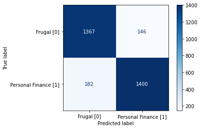

# Executive Summary:

## Problem Statement:
He actually did it! Long time friend Ben Seller sold off his dad's old real estate company and invested it ALL into bitcoin! Lucky for him he bought at just the right time and bitcoin skyrocketed! He's a millionaire! Ben has come to me asking for help, again. He has been receiving a massive outpouring of financial advice from his friends and family, and he needs a quick way to decide what is actual financial advice and what is not.

By pulling data from the popular website Reddit, specifically the subreddits r/personalfinance and r/frugal, I will construct a model that will determine if the advice Ben is being given is “sound” financial advice, or just general advice about ways to save money.

## Organization of the Project:

There are 4 notebooks in this project. Each notebook tackling a different part of the project. You will find a notebook with all the data scrapping from reddit, a notebook with the data cleaning and EDA, a notebook with all the models and model iterations, and finally a model analysis and conclusion notebook. The notebooks are meant to be read in that order, however feel free to jump around in any order you would like. 

## The Selected Model:

Extensive test modeling was done using several different model types including Logistic Regression, Random Forest, Extra Trees and XGBoost Classifier. 

Each model was tuned for hyperparameters to make sure they were performing as best they can. 

After all this testing it was determined that a random forest classification model will be used. 

## Model Performance: 

The model performed well, giving an accuracy score 0.89 and performing well on all other metrics as well. The accuracy was chosen as the main metric wich witch to evaluate because there was no need to worry about minimizing false positives or false negatives. Instead it was more important for the model to have the highest accuracy possible. The random forest model provided the highest accuracy without demonstrating an excessive amount of over-fitting. This made it the obvious model to choose. 

| metric: | Accuracy | Sensitivity | Specificity | Precision |
|---------|----------|-------------|-------------|-----------|
| Score   | 0.89     | 0.88        | 0.90        | 0.91      |

## Conclusion and Recommendation:

The random forest model scored moderately well on the data provided to it from the selected subreddits. It doesn’t have the ability to detect the meaning behind words, but there does appear to be enough difference in the language of the subreddits for the model to carry merit. It seems to be reasonably effective at parsing through financial suggestions and finding the ones that sound more like legitimate financial advice. I recommend to Mr. Seller to not inform his friends how the model functions, because it does appear to have some weaknesses.

recommend that this model can be used as a preliminary tool for filtering out financial suggestions from Mr. Sellers friends. There are some downsides to the model to consider, so do not use it as the only means of deciding what advice to take. However, it can function well as an early filter. It is concluded that there is a meaningful difference between the language of the selected subreddits, enough to build a model that performs well on several performance metrics. 
